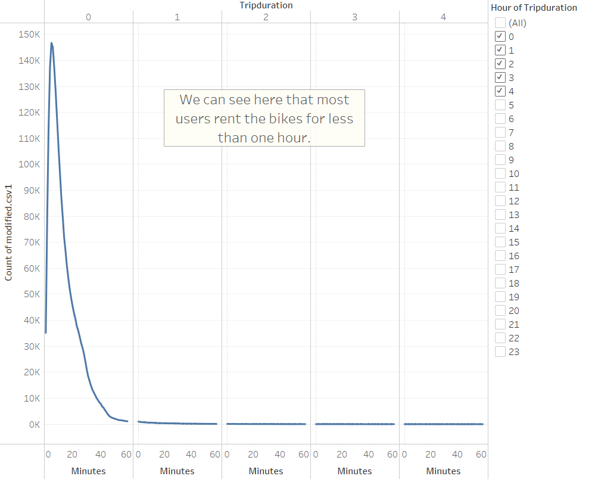
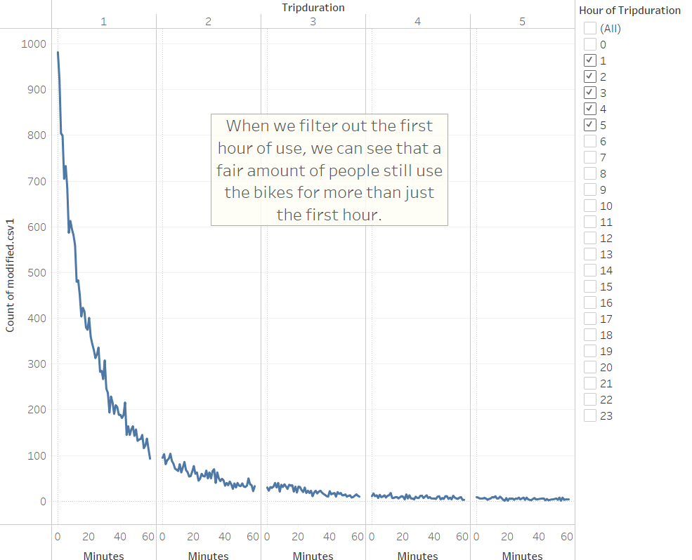
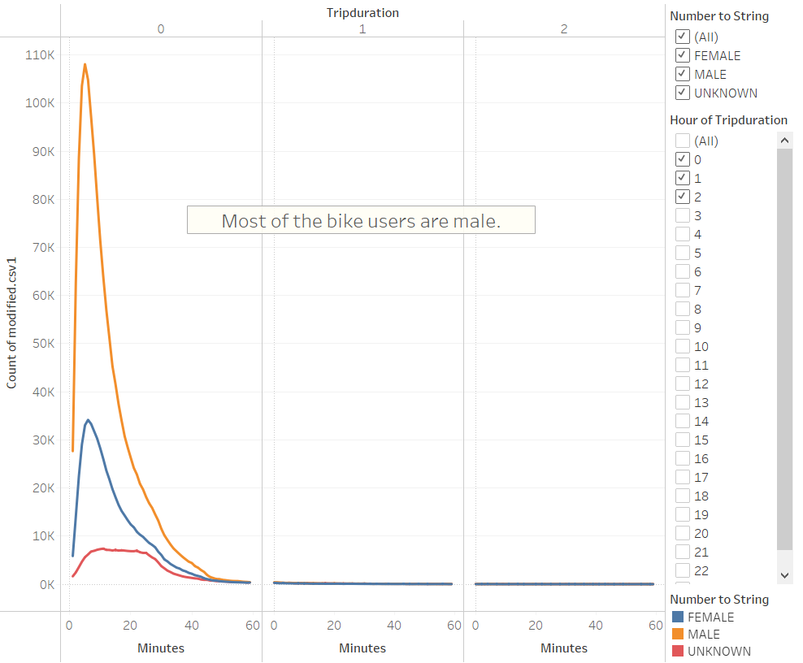
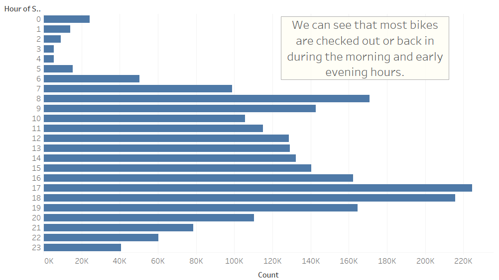
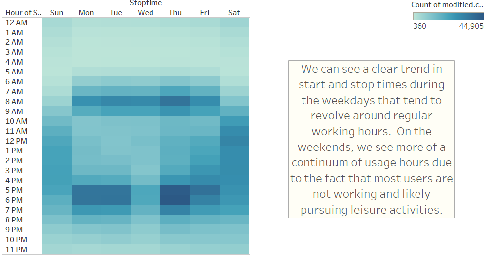
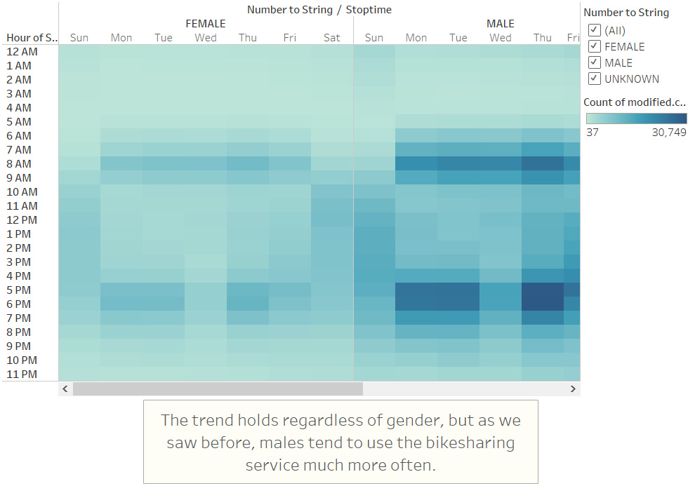
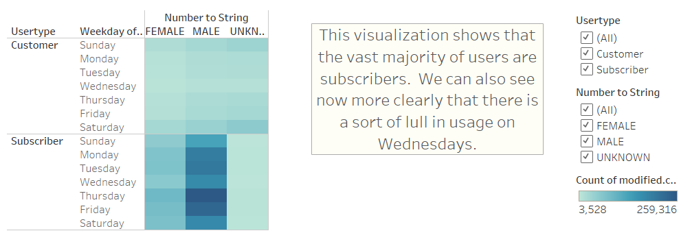
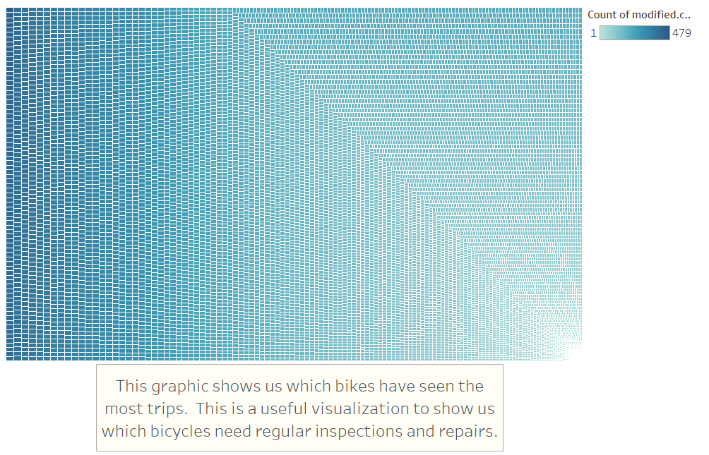

# bikesharing

## Overview

The purpose of this analysis is to explore the Citibike data from NYC in order to get an idea of what business might look like in Des Moines, IA.  The data is pulled from a web source and analyzed using a Tableau workbook as well as a bit of python.

## Results

The Tableau story attached to this workbook can be found at [here](https://public.tableau.com/app/profile/mark.esposito/viz/Mod14Challenge_16230162495870/BikesharingStory).

In the above image, we can see that most bikes are rented for less than one hour.  Using this information along with data to follow,  we can get a good idea of roughly how many bikes we may need in the Des Moines area in order to serve the population.

Although most users rent bikes for less than one hour, when we filter that first hour out, we can see that a fair amount of users still use the bikes for more than an hour.  The number of uses tapers off dramatically after the second hour.  We must keep in mind that NYC is indeed much larger than Des Moines, so the usage times may be less for a Citibike operation in Des Moines.

We can split the previous visualization by gender in order to get an idea of the gender profile of Citibike users.

Here we can see the busiest hours of most days are in the early morning and the early evening, corresponding to the beginning and end of the work day.  We can speculate many people rely on the Citibikes to commute to and from work.

We now see the same data broken down by weekday.  Our previous assumption is strengthened as we see the early morning and early evening trend on workdays, with a more normal distribution on the weekends.

We can, as before, separate this visualization by gender.  We see what we would guess, many more men use the Citibike service than women or unknown.

This heatmap divides the previous dataset by user type: customer or subscriber.  We can see that the vast majority of users are subscribers, with only a small portion being customers, and of those customers, most are of unknown gender.

Finally, we can use this marker plot to see which bikes have seen the most use in order to determine which bikes are getting close to needing regular service and repairs.

## Summary

Most users are male subscribers, and the busiest times of the weekdays likely correspond to users commuting to and from work with a more normal distribution of use times on the weekends.  Furthermore, most rentals are for less than one hour, which may give us a starting point for how many bikes we should have for Des Moines.  We would simply compare the population densities and total populations of the two cities.

It would also be useful to gather data on usage reasons from the bikes.  If a user were given a simple binary decision of business/leisure when they check out a bike, we would be able to more accurately predict when and where there will be spikes in demand for bikes.  Furthermore, it would be useful to analyze how often someone starts a trip with a bike in a high usage area and ends the trip in a very low usage area.  These bikes might not see much further use if they are checked out in the middle of downtown and then ridden miles away to the suburbs.  These types of trips might create a shortage of bikes in the busiest areas during primetime for Citibike usage.